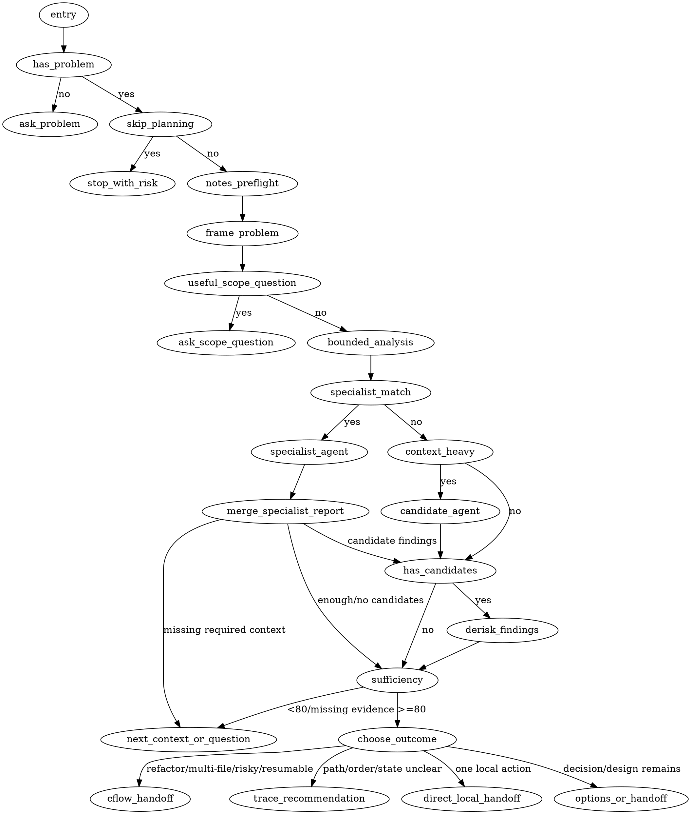

# cf-mr-wolf Flow

## Purpose

Document the runtime flow for `cf-mr-wolf`, the public entrypoint for clarifying unclear problems, feature ideas, refactors, architecture changes, and implementation tasks before execution.

## Runtime Inputs

- Public skill: `skills/cf-mr-wolf/SKILL.md`
- Runtime references: `skills/cf-mr-wolf/references/framing.md`, `evidence.md`, `agents.md`, `outcomes.md`
- Custom agent source: `skills/_codex_agents/cflow_candidate_finding_recon.toml`
- Custom agent source: `skills/_codex_agents/cflow_finding_derisk_recon.toml`
- Current conversation and user request
- Focused repository context selected from the problem frame
- Notes artifact: `.cflow/mr-wolf-notes.md`, created from `skills/cf-mr-wolf/assets/mr-wolf-notes.template.md`

## Runtime Diagram

`skills/cf-mr-wolf/SKILL.md` owns the runtime DOT diagram and reference map.
Phase-specific runtime rules live in `skills/cf-mr-wolf/references/` and are loaded only when their DOT nodes are reached.
The diagram is a first-match routing contract: once a terminal branch selects a route or question, lower-priority outcomes must not be evaluated.

## Outcome Priority

When confidence is sufficient, choose exactly one outcome route in this order:

1. Cleanup/refactor candidates, multiple candidate files, ordered work, risky work, or resumable work -> completed handoff to `cf-start`.
2. Unclear multi-step path, ordering risk, state gap, or workflow flaw without a specific refactor yet -> recommend `cf-trace`.
3. One explicit local action with no broader Cflow planning or resume state -> hand off to `cf-split`, `cf-cognitive`, or `cf-cohesion` only when it clearly owns that action.
4. Multiple credible product, architecture, or implementation directions -> present options with recommendation first.
5. Bounded problem ready for another worker or follow-up skill -> completed handoff with scope, non-goals, confidence, notes status, and next step.

## Flow

1. Entry: trigger `cf-mr-wolf` directly, or route from `cf-start` when the upstream problem is too unclear for Cflow assessment. If no concrete problem or task is present, ask exactly one question: what problem should be solved.
2. Notes preflight: if a problem exists, apply the `Artifacts` bootstrap rule when notes must be created, read `.cflow/mr-wolf-notes.md` when present, or create it from the template when missing. Decide whether existing notes are relevant to the current request and repository state; reuse or reset it based on relevance.
3. Problem frame: frame the apparent goal, uncertainty, likely scope, and success criteria. Choose the smallest context slice that can confirm or reject the frame. For a clear goal with broad possible scope, ask one focused scoping question before broad inventory when the answer can reduce an unnecessarily large work area.
4. Bounded analysis: run the problem-framing pass first, then build the smallest useful context slice with evidence channels such as MCP resources/tools, system commands, bundled repo tree output, and deterministic `/tmp` scripts.
5. Specialist delegation: after the frame and context slice are bounded, check available skills. If one clearly matches the needed analysis, prefer a read-only dynamic specialist agent over generic candidate discovery or local-only review. Choose `gpt-5.4-mini` medium for mechanical checks and `gpt-5.5` high for reasoning-heavy analysis. Pass only the problem frame, success criteria, non-goals, selected context, exclusions, evidence summary, and required skill name.
6. Evidence notes: record only evidence-producing tools in `evidence tools used`; do not list note-writing/editing tools as evidence.
7. Specialist report merge: treat the specialist report as primary evidence, update notes, then continue to candidate classification, sufficiency, or one focused context question based on the report.
8. Multi-candidate sufficiency: for repo-wide or multi-candidate work, run broad inventory, narrowing pass, candidate discovery, and finding de-risk checks before calling the context sufficient.
9. Candidate discovery: when no specialist skill clearly matches, or the specialist report leaves broad candidate discovery uncovered, use `cflow_candidate_finding_recon` when available; pass only repository path, problem frame, success criteria, non-goals, bounded evidence path/summary, selected context slice, and exclusions. Do not cap candidate findings at three.
10. Finding de-risk: when bounded analysis produces candidate findings and the next step might be a fix, route, or completed handoff, select all or the decision-blocking subset for de-risk. When finding de-risk is multi-candidate, call-path-heavy, or context-heavy, use `cflow_finding_derisk_recon` when available.
11. Agent sequencing: Run specialist and custom agents sequentially only; wait for the current report before starting any later discovery or de-risk pass, and never run multiple agents at the same time. Treat reports as primary evidence; merge them before sufficiency, fix recommendation, or completed handoff.
12. Classification: classify each de-risked finding as confirmed, false-positive, or uncertain. Inspect only selected evidence, separate signal from noise, and update notes with confirmed candidates, candidates to verify, and excluded false positives, not exhaustive rejected lists.
13. Confidence: assign an investigation confidence percentage and record the basis. `sufficient` requires at least 80% confidence unless the user explicitly accepts the risk, and repo-wide or multi-candidate work stays below 80% if deterministic inventory, focused verification, finding de-risk checks, used-channel notes, or required skipped-channel reasons are missing.
14. Next context: if context is insufficient, ask one focused question or inspect the next smallest justified slice.
15. Outcome: if the evidence points to cleanup/refactor candidates, stop at evidence-backed handoff and recommend `cf-start`; do not route straight to `cf-split`, `cf-cognitive`, or `cf-cohesion` unless the user requested one explicit local action. If evidence points to an unclear path, ordering risk, state gap, or workflow flaw without a specific refactor yet, recommend `cf-trace`.
16. Handoff: once clear enough, recommend a direction or present 2-3 options with trade-offs. Select a short recommended next step with a reason, naming a specialized available skill when it clearly owns the best follow-up. For Cflow cleanup/refactor work, ask whether to preserve the discovery through `.cflow/refactor-brief.md` and continue with `cf-start`; do not create that brief directly from `cf-mr-wolf`.
17. Route basis: base the outcome route on current request, evidence, confidence, and artifact state, not on which skill or user path invoked this pass.

## Contracts

| Situation | Required behavior | May edit code |
| --- | --- | --- |
| invoked without a problem | ask what problem must be solved before inspecting repository context | no |
| invoked with a problem | read or create `.cflow/mr-wolf-notes.md`, applying the `Artifacts` bootstrap rule when notes must be created, then reuse or reset notes based on relevance | no |
| ambiguous problem | inspect only the smallest relevant context slice, recap sufficiency, ask one focused question if needed | no |
| clear goal with broad possible scope | ask one focused scoping question before broad inventory when the answer can materially narrow the work | no |
| many deterministic inputs | use commands, bundled repo tree output, or temporary `/tmp` scripts for mechanical analysis, then interpret the compact output | no |
| relevant specialist skill exists | delegate read-only analysis to one dynamic specialist agent over the selected context slice, merge the report, and keep final judgment in the handoff | no |
| bounded evidence is context-heavy | use `cflow_candidate_finding_recon` when available, then treat its report as the primary candidate discovery scan | no |
| candidate discovery finds more than three material findings | carry all material candidates forward, grouping equivalents and naming minor, deferred, out-of-scope, or non-actionable observations | no |
| finding de-risk is multi-candidate, call-path-heavy, or context-heavy | use one `cflow_finding_derisk_recon` pass at a time, then merge any sequential reports as the primary finding de-risk scan | no |
| any specialist or custom agent is used | run agents sequentially only; never run multiple agents at the same time | no |
| candidate finding might lead to a fix or handoff | classify each finding as confirmed, false-positive, or uncertain with reachability and fix-fit evidence before recommending implementation | no |
| repo-wide or multi-candidate discovery | run broad inventory, narrowing pass, finding de-risk checks, and record confidence before declaring sufficiency | no |
| cleanup/refactor candidate list | summarize evidence and hand off to `cf-start`; do not route straight to `cf-split`, `cf-cognitive`, or `cf-cohesion` unless the user requested one explicit local action | no |
| clear enough for options | present recommended direction first, with only real alternatives and trade-offs | no |
| completed handoff | separate confirmed, false-positive, and uncertain findings; include fix-fit before recommending implementation; name a specialized available skill when it clearly owns the follow-up | no |
| false positives | record only important excluded false positives, not every non-candidate file | no |
| explicit skip | note the biggest missing requirement or risk briefly, then hand off or proceed as authorized | only after handoff |
| routed from `cf-start` | clarify upstream problem and return a handoff; keep notes current | no |

## Review Checks

- The skill is a pragmatic problem fixer, not a generic planning worksheet.
- The runtime DOT diagram and outcome priority are the single branch-order contract for route selection.
- It asks for the problem first when invoked without instructions.
- It narrows context before reading, and avoids whole-repository scans by default.
- It asks one scoping question before broad inventory when a clear goal still leaves an unnecessarily large work area.
- It separates problem framing from bounded analysis.
- It uses available tools, bundled repo tree output, and deterministic temporary scripts instead of making the model do mechanical analysis.
- It considers clearly matching specialist skills only after the problem frame and context slice are bounded.
- It prefers read-only dynamic specialist agents over generic candidate discovery when a skill clearly matches.
- It selects cheaper specialist models for mechanical work and higher-reasoning models for ambiguous or judgment-heavy work.
- It records specialist agent reports or no-match reasons.
- Specialist evidence informs the handoff; it does not replace final judgment.
- It recommends specialized available skills as next steps when they clearly own the follow-up.
- It does not declare discovery sufficient below 80% confidence unless the user accepts the risk.
- It narrows repo-wide investigations through broad inventory, candidate verification, and finding de-risk checks.
- It does not cap candidate findings at three.
- It runs specialist and custom agents sequentially only.
- It does not recommend fixes for candidate findings until reachability, false positives, and fix-fit have been checked or explicitly handed off for verification.
- It keeps `.cflow/mr-wolf-notes.md` as compact investigation notes, not an execution plan.
- It records `confirmed candidates`, `candidates to verify`, and `excluded false positives`, not exhaustive rejected lists.
- It states what context was excluded as noise and why.
- It hands multi-file cleanup/refactor discovery to `cf-start` rather than starting execution skills directly.
- It does not create large specs for small tasks.
- `cf-start` remains the controller for Cflow assessment, planning, execution, review, verification, feedback intake, and resume.
