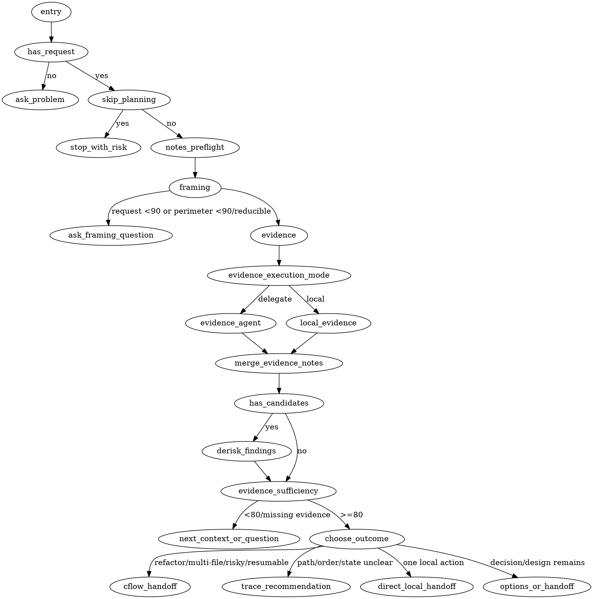

# cf-mr-wolf Flow

## Purpose

Document the runtime flow for `cf-mr-wolf`, the public entrypoint for clarifying unclear problems, feature ideas, refactors, architecture changes, and implementation tasks before execution.

## Runtime Inputs

- Public skill: `skills/cf-mr-wolf/SKILL.md`
- Runtime references: `skills/cf-mr-wolf/references/framing.md`, `evidence.md`, `dynamic-agents.md`, `derisk.md`, `outcomes.md`
- Custom agent source: `skills/_codex_agents/cflow_finding_derisk_recon.toml`
- Current conversation and user request
- Focused repository context selected from the clarified request and bounded perimeter
- Notes artifact: `.cflow/mr-wolf-notes.md`, created from `skills/cf-mr-wolf/assets/mr-wolf-notes.template.md`

## Runtime Contract

`skills/cf-mr-wolf/SKILL.md` owns the runtime phase order, hard gates, and first-level reference loading rules.
Phase-specific runtime rules live in `skills/cf-mr-wolf/references/` and are loaded only for the active phase.
For the evidence phase, the controller may execute the active reference locally or delegate the same reference task to a dynamic agent.
`dynamic-agents.md` contains common rules for dynamic read-only execution of an active reference and is read only after the controller chooses dynamic delegation.
`derisk.md` binds the packaged custom agent to the de-risk task that selects it.
References must not be loaded with `SKILL.md`; they are progressive-disclosure material for the phase that needs them.
The DOT diagram below is a maintainer visualization only; the phase list in `SKILL.md` is the runtime contract.

## Outcome Priority

When confidence is sufficient, choose exactly one outcome route in this order:

1. Cleanup/refactor candidates, multiple candidate files, ordered work, risky work, or resumable work -> hand off to `cf-start`.
2. Unclear path, ordering, state, or workflow flaw without a specific refactor -> recommend `cf-trace`.
3. One explicit local action owned by `cf-split`, `cf-cognitive`, or `cf-cohesion` -> hand off to the owning local execution skill.
4. Unresolved directions or a bounded problem ready for handoff -> present options or a bounded handoff.

## Flow

1. Entry: trigger `cf-mr-wolf` directly, or route from `cf-start` when the upstream problem is too unclear for Cflow assessment. If no concrete problem or task is present, ask exactly one question: what problem should be solved.
2. Notes preflight: if a problem exists, apply the `Artifacts` bootstrap rule when notes must be created, read `.cflow/mr-wolf-notes.md` when present, or create it from the template when missing. Decide whether existing notes are relevant to the current request and repository state; reuse or reset it based on relevance.
3. Framing: frame the intended request, success criteria, constraints, explicit non-goals, uncertainty, and useful perimeter. If the request can be interpreted materially differently, ask one focused clarifying question and continue only when request clarity is about 90%. After the request is clear, ask one focused scoping question when the answer can reduce candidate areas, priority, success criteria, constraints, risk, or validation; continue only when perimeter clarity is about 90% or the user accepts the broader scope.
4. Evidence: collect bounded context, update `.cflow/mr-wolf-notes.md`, gather focused evidence from the notes, carry forward candidate findings without treating them as final, and decide whether evidence is sufficient. Execute locally or delegate the same `evidence.md` task to a dynamic agent; if delegating, apply `dynamic-agents.md` as common agent rules.
5. Agent sequencing: run evidence and de-risk agents sequentially only. Wait for the current report before starting any later agent pass, and never run multiple agents at the same time.
6. Evidence merge: treat agent reports or local evidence checks as primary evidence, update notes, and carry forward all material candidate findings. Do not cap findings at three; group equivalents and explicitly name minor, deferred, out-of-scope, or non-actionable observations when they affect the decision.
7. Finding de-risk: whenever candidate findings exist before final output, use `cflow_finding_derisk_recon` to classify every candidate that influences a fix, route, recommendation, or completed handoff. Leave unchecked findings as `candidates to verify`, not confirmed findings.
8. Classification: classify de-risked findings as confirmed, false-positive, or uncertain. Update notes with confirmed candidates, candidates to verify, and excluded false positives, not exhaustive rejected lists.
9. Next context: if context or evidence is insufficient, ask one focused question or inspect the next smallest justified slice.
10. Outcome: if the evidence points to cleanup/refactor candidates, stop at evidence-backed handoff and recommend `cf-start`; do not route straight to `cf-split`, `cf-cognitive`, or `cf-cohesion` unless the user requested one explicit local action. If evidence points to an unclear path, ordering risk, state gap, or workflow flaw without a specific refactor yet, recommend `cf-trace`.
11. Handoff: once clear enough, recommend a direction or present 2-3 options with trade-offs. Select a short recommended next step with a reason, naming a specialized available skill when it clearly owns the best follow-up. For Cflow cleanup/refactor work, ask whether to preserve the discovery through `.cflow/refactor-brief.md` and continue with `cf-start`; do not create that brief directly from `cf-mr-wolf`.
12. Route basis: base the outcome route on current request, evidence, confidence, and artifact state, not on which skill or user path invoked this pass.

## Contracts

| Situation | Required behavior | May edit code |
| --- | --- | --- |
| invoked without a problem | ask what problem must be solved before inspecting repository context | no |
| invoked with a problem | read or create `.cflow/mr-wolf-notes.md`, applying the `Artifacts` bootstrap rule when notes must be created, then reuse or reset notes based on relevance | no |
| ambiguous request | ask focused clarification until request clarity is about 90%, or the user accepts the ambiguity | no |
| reducible perimeter | ask focused scope questions until perimeter clarity is about 90%, or the user accepts the broader scope | no |
| many deterministic inputs | use commands, MCP, bundled repo tree output, or temporary `/tmp` scripts for mechanical analysis, then interpret the compact output | no |
| evidence scope is non-trivial, not small, or mechanically broad | execute the active evidence reference locally or delegate the same reference task to a dynamic agent unless the task is one explicit local action with cheap checks | no |
| evidence phase finishes | always update `.cflow/mr-wolf-notes.md`, whether evidence came from an agent or the controller | no |
| candidate discovery finds more than three material findings | carry all material candidates forward, grouping equivalents and naming minor, deferred, out-of-scope, or non-actionable observations | no |
| candidate findings exist before final output | use `cflow_finding_derisk_recon` for every candidate that influences a fix, route, recommendation, or completed handoff | no |
| any agent is used | run agents sequentially only; never run multiple agents at the same time | no |
| de-risk packaged custom agent is used | pass bounded inputs and wait for the report; do not read or paste the TOML | no |
| repo-wide or multi-candidate discovery | run the evidence phase with broad inventory when needed, focused evidence checks, and confidence recording before declaring evidence sufficiency | no |
| cleanup/refactor candidate list | summarize evidence and hand off to `cf-start`; do not route straight to `cf-split`, `cf-cognitive`, or `cf-cohesion` unless the user requested one explicit local action | no |
| clear enough for options | present recommended direction first, with only real alternatives and trade-offs | no |
| completed handoff | separate confirmed, false-positive, and uncertain findings; include fix-fit before recommending implementation; name a specialized available skill when it clearly owns the follow-up | no |
| false positives | record only important excluded false positives, not every non-candidate file | no |
| explicit skip | note the biggest missing requirement or risk briefly, then hand off or proceed as authorized | only after handoff |
| routed from `cf-start` | clarify upstream problem and return a handoff; keep notes current | no |

## Review Checks

- The skill is a pragmatic problem fixer, not a generic planning worksheet.
- The runtime phases in `SKILL.md` and outcome priority are the branch-order contract for route selection.
- It asks for the problem first when invoked without instructions.
- It asks focused clarification until the request is about 90% clear when the input can be misread.
- It asks focused scope questions until the perimeter is about 90% clear and not usefully reducible.
- It keeps request clarification and perimeter reduction in one framing phase, then separates evidence and de-risk.
- It uses available tools, MCP, bundled repo tree output, and deterministic temporary scripts instead of making the model do mechanical analysis.
- It always records evidence in `.cflow/mr-wolf-notes.md`, whether it came from an agent or the controller.
- It delegates dynamic agents to execute the same active reference task the controller would otherwise run locally.
- It uses available specialist skills as local evidence lenses after context has been collected into notes.
- It uses local evidence checks for focused verification.
- It keeps common dynamic-agent execution rules in `dynamic-agents.md`, not in each phase-specific agent contract.
- It binds packaged de-risk to `derisk.md`.
- It selects cheaper dynamic models for mechanical work and higher-reasoning models for judgment-heavy work.
- It treats the de-risk packaged custom agent as an interface; the controller does not read or paste TOML.
- Agent evidence informs the handoff; it does not replace final judgment.
- It recommends specialized available skills as next steps when they clearly own the follow-up.
- It does not declare discovery sufficient below 80% confidence unless the user accepts the risk.
- It narrows repo-wide investigations through context collection, evidence collection, and finding de-risk checks.
- It does not cap candidate findings at three.
- It runs evidence and de-risk agents sequentially only.
- It de-risks every candidate finding that influences final output.
- It does not recommend fixes for uncertain findings unless the next step is verification.
- It keeps `.cflow/mr-wolf-notes.md` as compact investigation notes, not an execution plan.
- It records `confirmed candidates`, `candidates to verify`, and `excluded false positives`, not exhaustive rejected lists.
- It states what context was excluded as noise and why.
- It hands multi-file cleanup/refactor discovery to `cf-start` rather than starting execution skills directly.
- It does not create large specs for small tasks.
- `cf-start` remains the controller for Cflow assessment, planning, execution, review, verification, feedback intake, and resume.
