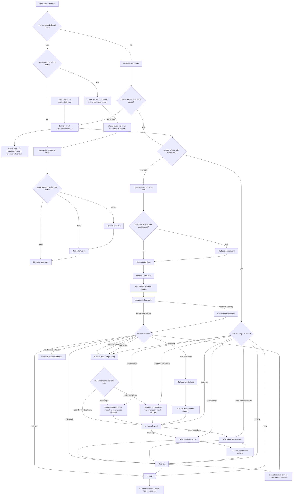

# Cflow Workflow Map

This document is the shortest end-to-end view of how Cflow is meant to run in a target repository.
Use it for orientation.
Use [maintaining-this-pack.md](./maintaining-this-pack.md) and [skill-contract-matrix.md](./skill-contract-matrix.md) for the full contract details.

Mermaid is used here because the main thing missing from the docs was branch and resume visibility.
The phase index below is the text fallback if the diagram is not rendered.

## Core Rules

- `cf-start` is the main supported direct user entrypoint for workflow execution and resume.
- `cf-architecture-map` is also a supported direct user entrypoint, but only for standalone repository mapping.
- `cf-refine` is also a supported direct user entrypoint, but only for one bounded local refinement pass.
- `cflow-skills install` only syncs `skills/`; it does not create `.cflow/`.
- All remaining skills are internal workflow steps, not supported user-facing entrypoints.
- Internal workflow skills should still be implicitly invocable in Codex when their descriptions match the current step.
- If a skill is reached without required architecture context, it should stop and route to `cf-architecture-map`.
- If a skill is reached without some earlier workflow context beyond architecture, it should stop and route to `cf-start` or the required earlier phase.
- `soft-mixed` is allowed only as a repository-level assessment outcome; each executable work unit must still declare exactly one mode: `split` or `consolidate`.

## End-To-End Flow

## How To Read The Diagram

- Fresh non-trivial work always stops at the alignment checkpoint before implementation.
- `cf-start` ensures architecture context is current before fresh assessment or resume; when it is not, it routes through `cf-architecture-map` first.
- `cf-architecture-map` can also be used standalone and stop cleanly after updating `.cflow/architecture.md`.
- `cf-refine` is a separate public path for one bounded local pass. If the task becomes structural, multi-step, or architecture-shaping, it must route to `cf-start` instead of stretching the refine pass.
- A short approval can continue directly from the checkpoint.
- Any non-trivial steering after the checkpoint must go through `cf-phase-brainstorming` first.
- Repository-level assessment framing may stay inside `cf-start` or use `cf-phase-assessment` when a dedicated pass is needed.
- Lightweight work normally enters `cf-phase-work-unit-planning` before local mapping or execution so the brief records the ordered backlog and the recommended next unit.
- Hard-path work must define target shape and migration units before code edits.
- Resume is not its own phase; `cf-start` re-enters the correct phase using the brief, the current architecture map, and repository state.

## Phase Index

| Stage | Skills | What happens | May edit code |
| --- | --- | --- | --- |
| Architecture mapping and bootstrap | `cf-architecture-map` | Creates or refreshes `.cflow/architecture.md`, bootstraps `.cflow/`, updates `.gitignore` for `.cflow/`, and returns without planning work units. | No |
| Local refine entry | `cf-refine` | Applies one bounded local cleanup pass, or routes to `cf-start` when the work is really structural, multi-step, or architecture-shaping. | Yes |
| Workflow entry and resume | `cf-start` | Uses current artifacts, ensures architecture context is current, and decides whether this is fresh assessment, resume, review, or verify. | Indirectly, only by routing into execution later |
| Repository assessment | `cf-start`, `cf-phase-assessment` | Checks whether intervention is justified, records candidate intervention areas, and frames plausible direction using the current architecture map. | No |
| Alignment | `cf-start`, `cf-phase-brainstorming` | Stops after fresh assessment, then resolves user steering before execution continues. | No |
| Work-unit planning | `cf-phase-work-unit-planning` | Orders credible bounded work units, records dependencies, and chooses the recommended next unit without invoking hard-path structural planning. | No |
| Local mapping | `cf-phase-concentration-map`, `cf-phase-fragmentation-map` | Maps the active seam and clarifies whether the next bounded unit should split or consolidate. | No |
| Hard-path planning | `cf-phase-target-shape`, `cf-phase-migration-unit-planning` | Defines a repository-fitting target direction and breaks it into bounded migration units that prove that direction incrementally. | No |
| Safety lock | `cf-step-safety-net` | Chooses the smallest credible behavior lock before structural work. | No |
| Structural execution | `cf-step-boundary-apply`, `cf-step-consolidate-seam` | Applies exactly one bounded structural unit, preserving behavior. | Yes |
| Local cleanup | `cf-step-local-simplify` | Improves naming and local readability after a structural step without reopening architecture. | Yes |
| Judgment and evidence | `cf-review`, `cf-verify`, `cf-feedback-intake` | Reviews structural quality, gathers factual verification, and turns feedback into a verified next action. | No |

## Typical Sequences

### Standalone Architecture Map

`cf-architecture-map` -> update `.cflow/architecture.md` -> stop or continue with `cf-start`

### Local Refine

`cf-refine` -> optional `cf-architecture-map` -> optional `cf-step-safety-net` -> local refine pass -> optional `cf-review` -> optional `cf-verify`

### Soft Split

`cf-start` -> alignment checkpoint -> `cf-phase-work-unit-planning` -> `cf-phase-concentration-map` -> `cf-step-safety-net` -> `cf-step-boundary-apply` -> optional `cf-step-local-simplify` -> `cf-review` -> `cf-verify`

### Soft Consolidate

`cf-start` -> alignment checkpoint -> `cf-phase-work-unit-planning` -> `cf-phase-fragmentation-map` -> `cf-step-safety-net` -> `cf-step-consolidate-seam` -> optional `cf-step-local-simplify` -> `cf-review` -> `cf-verify`

### Hard Restructure

`cf-start` -> alignment checkpoint -> `cf-phase-target-shape` -> `cf-phase-migration-unit-planning` -> `cf-step-safety-net` -> one bounded execution unit -> `cf-review` -> `cf-verify`

### Resume

`cf-start` -> ensure current `.cflow/architecture.md` -> re-enter work-unit planning, mapping, safety-net, execution, review, or verify based on `.cflow/refactor-brief.md` and current repository state

## Artifacts Through The Flow

- Installer output lives in the target skill directory: `.agents/skills/` for local install, or `$CODEX_HOME/skills` / `~/.codex/skills` for global install.
- Runtime state lives in the target repository under `.cflow/`.
- The canonical runtime artifacts are:
  - `.cflow/architecture.md`
  - `.cflow/refactor-brief.md`
- `cf-architecture-map` owns bootstrap of `.cflow/`, updates `.gitignore` when needed, and creates or refreshes `.cflow/architecture.md`.
- `cf-refine` does not create `.cflow/*` itself; it may route through `cf-architecture-map` when internal safety, review, or verify skills need architecture context.
- `cf-start` owns workflow entry plus creation or refresh of `.cflow/refactor-brief.md` when needed.
- Execution, review, and verification skills keep the brief current as the handoff record between invocations.
