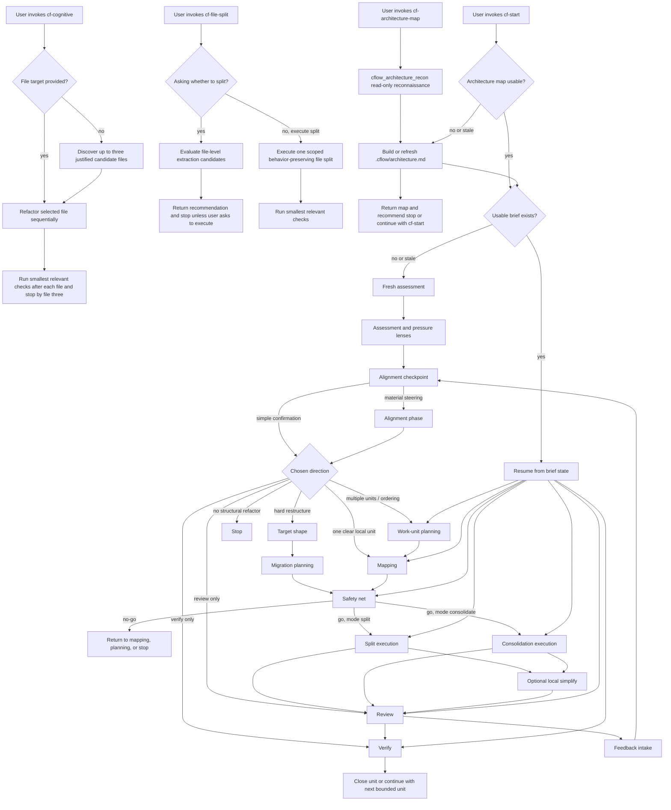

# Cflow Workflow Map

This document is the end-to-end view of how Cflow runs in a target repository.
Use [maintaining-this-pack.md](./maintaining-this-pack.md) and [skill-contract-matrix.md](./skill-contract-matrix.md) for contract details.

## Core Rules

- `cf-start` is the main supported direct user entrypoint for workflow execution and resume.
- `cf-start` also owns the internal workflow phases by loading `skills/cf-start/references/*.md`.
- `cf-architecture-map` is the supported direct repository-mapping entrypoint.
- `cf-cognitive` is the supported direct local cognitive complexity entrypoint and does not require `.cflow/`.
- `cf-file-split` is the supported direct local file-level split entrypoint and does not require `.cflow/`.
- `cflow-skills install` syncs packaged skills, shared support resources, and Cflow-owned Codex custom agents; it does not create `.cflow/`.
- If a workflow phase lacks required architecture context, `cf-start` routes to `cf-architecture-map`.
- `soft-mixed` is allowed only as a repository-level assessment outcome; each executable work unit must still declare exactly one mode: `split` or `consolidate`.
- A local fast lane may skip work-unit planning only when one explicit, local, low-risk, behavior-preserving cohesive unit is already clear enough to map, lock, or execute.
- Work-unit planning is required when multiple candidates, dependency/order decisions, cross-boundary scope, or resumable multi-step work must be sequenced.

## End-To-End Flow

## Phase Index

| Stage | Runtime owner | What happens | May edit code |
| --- | --- | --- | --- |
| Architecture mapping and bootstrap | `cf-architecture-map` | Uses the read-only `cflow_architecture_recon` custom agent when available; the controller avoids parallel repo scanning, then creates or refreshes `.cflow/architecture.md`, bootstraps `.cflow/`, and updates `.gitignore` for `.cflow/`. | No |
| Local cognitive complexity | `cf-cognitive` | Finds or refactors up to three source files sequentially without bootstrapping Cflow artifacts. | Yes |
| Local file-level split | `cf-file-split` | Evaluates or executes one behavior-preserving file-level split without bootstrapping Cflow artifacts. | Yes |
| Workflow entry and resume | `cf-start` + `routing.md` | Uses current artifacts, ensures architecture context, and chooses fresh assessment, resume, review, or verify. | Indirectly |
| Repository assessment and alignment | `cf-start` + `assessment.md` | Checks whether intervention is justified, frames pressure, and stops at alignment for non-trivial fresh work. | No |
| Work-unit and hard-path planning | `cf-start` + `work-unit-planning.md`, `target-shape.md`, `migration-unit-planning.md` | Orders units, defines hard target shape, or breaks hard path into migration units. | No |
| Local mapping | `cf-start` + `concentration-map.md`, `fragmentation-map.md` | Maps split or consolidation direction for the active seam. | No |
| Safety lock and execution | `cf-start` + `safety-net.md`, `split-execution.md`, `consolidation-execution.md`, `local-simplify.md` | Chooses behavior lock, applies one bounded split or consolidation step, and optionally simplifies local code. | Yes |
| Judgment and evidence | `cf-start` + `review.md`, `verify.md`, `feedback-intake.md` | Reviews structural quality, verifies with factual checks, and handles feedback. | No |

## Typical Sequences

Standalone architecture map:

`cf-architecture-map` -> update `.cflow/architecture.md` -> stop or continue with `cf-start`

Local cognitive complexity:

`cf-cognitive` -> use explicit files or discover up to three candidates -> refactor sequentially -> run checks -> stop by file three

Local file split:

`cf-file-split` -> evaluate candidates or execute one scoped split -> run checks when code changes -> stop

Soft split:

`cf-start` -> alignment checkpoint -> optional planning -> mapping -> safety net -> split execution -> optional local simplify -> review -> verify

Soft consolidate:

`cf-start` -> alignment checkpoint -> optional planning -> mapping -> safety net -> consolidation execution -> optional local simplify -> review -> verify

Hard restructure:

`cf-start` -> alignment checkpoint -> target shape -> migration planning -> safety net -> one bounded execution unit -> review -> verify

Resume:

`cf-start` -> ensure current `.cflow/architecture.md` -> re-enter the correct phase based on `.cflow/refactor-brief.md` and repository state

## Artifacts Through The Flow

- Installer skill output lives in `.agents/skills/` for local install, or `$CODEX_HOME/skills` / `~/.codex/skills` for global install.
- Installer Codex custom agent output lives in `.codex/agents/` for local install, or `$CODEX_HOME/agents` / `~/.codex/agents` for global install.
- Shared support references live under `_shared/`; they are linked explicitly by consuming skills and are not standalone skills.
- Runtime state lives in the target repository under `.cflow/`.
- The canonical runtime artifacts are `.cflow/architecture.md` and `.cflow/refactor-brief.md`.
- `cf-architecture-map` owns `.cflow/` bootstrap, `.gitignore` updates, and `.cflow/architecture.md`.
- `cf-start` owns workflow entry plus `.cflow/refactor-brief.md`.
- Execution, review, and verification phases keep the brief current as the handoff record between invocations.
