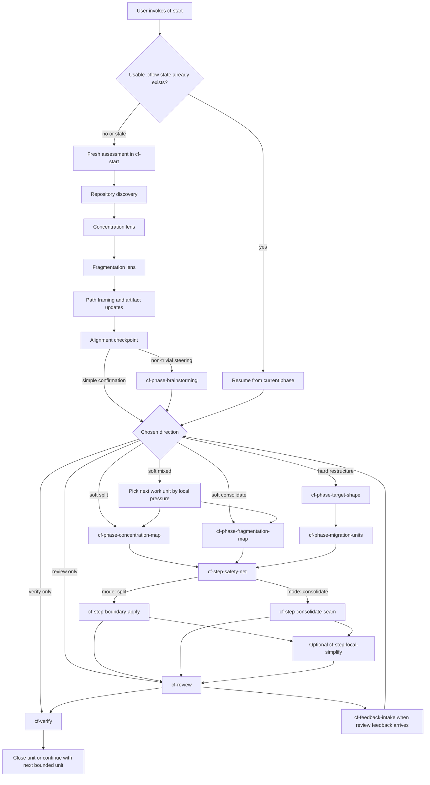

# Cflow Workflow Map

This document is the shortest end-to-end view of how Cflow is meant to run in a target repository.
Use it for orientation.
Use [maintaining-this-pack.md](./maintaining-this-pack.md) and [skill-contract-matrix.md](./skill-contract-matrix.md) for the full contract details.

Mermaid is used here because the main thing missing from the docs was branch and resume visibility.
The phase index below is the text fallback if the diagram is not rendered.

## Core Rules

- `cf-start` is the only supported direct user entrypoint.
- `cflow-skills install` only syncs `skills/`; it does not create `.cflow/`.
- Internal skills are workflow steps, not user-facing entrypoints.
- Internal workflow skills should still be implicitly invocable in Codex when their descriptions match the current step.
- If an internal skill is reached without the required context, it should stop and route back to `cf-start`.
- `soft-mixed` is allowed only as a repository-level assessment outcome; each executable work unit must still declare exactly one mode: `split` or `consolidate`.

## End-To-End Flow

## How To Read The Diagram

- Fresh non-trivial work always stops at the alignment checkpoint before implementation.
- A short approval can continue directly from the checkpoint.
- Any non-trivial steering after the checkpoint must go through `cf-phase-brainstorming` first.
- Hard-path work must define target shape and migration units before code edits.
- Resume is not its own phase; `cf-start` re-enters the correct phase using the brief and current repository state.

## Phase Index

| Stage | Skills | What happens | May edit code |
| --- | --- | --- | --- |
| Entry and bootstrap | `cf-start` | Reads existing `.cflow/*`, creates or refreshes artifacts when needed, and decides whether this is fresh assessment, resume, review, or verify. | Indirectly, only by routing into execution later |
| Repository assessment | `cf-start`, `cf-phase-discovery` | Builds repository-level understanding, checks whether intervention is justified, and frames plausible direction. | No |
| Alignment | `cf-start`, `cf-phase-brainstorming` | Stops after fresh assessment, then resolves user steering before execution continues. | No |
| Local mapping | `cf-phase-concentration-map`, `cf-phase-fragmentation-map` | Maps the active seam and clarifies whether the next bounded unit should split or consolidate. | No |
| Hard-path planning | `cf-phase-target-shape`, `cf-phase-migration-units` | Defines a repository-fitting target direction and breaks it into bounded migration units. | No |
| Safety lock | `cf-step-safety-net` | Chooses the smallest credible behavior lock before structural work. | No |
| Structural execution | `cf-step-boundary-apply`, `cf-step-consolidate-seam` | Applies exactly one bounded structural unit, preserving behavior. | Yes |
| Local cleanup | `cf-step-local-simplify` | Improves naming and local readability after a structural step without reopening architecture. | Yes |
| Judgment and evidence | `cf-review`, `cf-verify`, `cf-feedback-intake` | Reviews structural quality, gathers factual verification, and turns feedback into a verified next action. | No |

## Typical Sequences

### Soft Split

`cf-start` -> alignment checkpoint -> `cf-phase-concentration-map` -> `cf-step-safety-net` -> `cf-step-boundary-apply` -> optional `cf-step-local-simplify` -> `cf-review` -> `cf-verify`

### Soft Consolidate

`cf-start` -> alignment checkpoint -> `cf-phase-fragmentation-map` -> `cf-step-safety-net` -> `cf-step-consolidate-seam` -> optional `cf-step-local-simplify` -> `cf-review` -> `cf-verify`

### Hard Restructure

`cf-start` -> alignment checkpoint -> `cf-phase-target-shape` -> `cf-phase-migration-units` -> `cf-step-safety-net` -> one bounded execution unit -> `cf-review` -> `cf-verify`

### Resume

`cf-start` -> re-enter mapping, safety-net, execution, review, or verify based on `.cflow/refactor-brief.md` and current repository state

## Artifacts Through The Flow

- Installer output lives in the target skill directory: `.agents/skills/` for local install, or `$CODEX_HOME/skills` / `~/.codex/skills` for global install.
- Runtime state lives in the target repository under `.cflow/`.
- The canonical runtime artifacts are:
  - `.cflow/architecture.md`
  - `.cflow/refactor-brief.md`
- `cf-start` owns bootstrap of `.cflow/` and updates `.gitignore` when needed.
- Execution, review, and verification skills keep the brief current as the handoff record between invocations.
