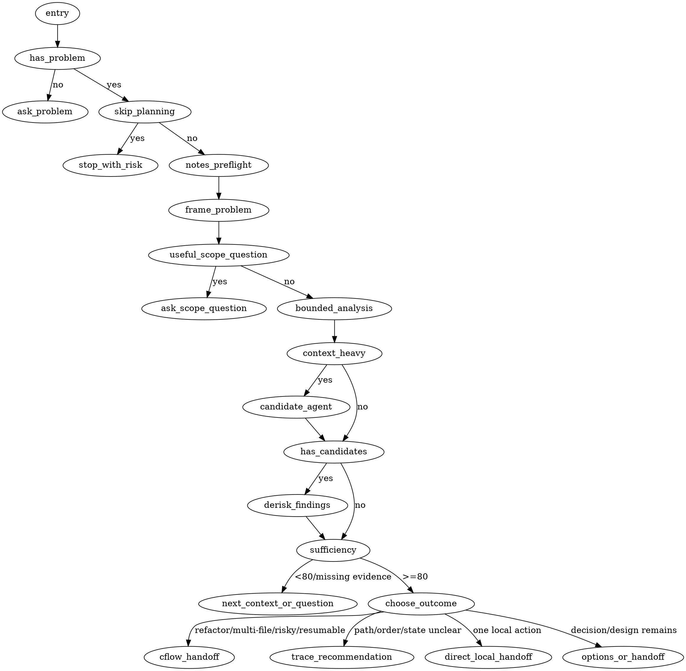

Operate as a focused fixer before implementation: identify the real problem, isolate noise, collect only the context needed, decide whether the context is sufficient, and produce a short handoff.

## Operating Principles

Use available tools, MCP resources, and deterministic scripts for evidence at any phase instead of model-only mechanical analysis.

## Runtime Artifacts

Artifact ownership and write rules:

- `.cflow/mr-wolf-notes.md`: owned here. For every concrete problem, before repository inspection, read existing notes if present or create them from `assets/mr-wolf-notes.template.md` if missing, then decide whether they match the current request and repository state before reusing, updating, or resetting them.
- `.cflow/architecture.md`: available input only when it can change the problem frame, scope, risk, validation, or handoff; never create or update it here.
- `.cflow/refactor-brief.md`: owned by `cf-start`, not this skill; for multi-file, risky, ordered, or resumable work, ask whether `cf-start` should preserve discovery there.

## Entry Behavior

DOT: `entry`, `has_problem`, `skip_planning`, `ask_problem`, `stop_with_risk`.

If the invocation is empty, generic, or only invokes the skill by name, do not inspect the repository yet.
Ask exactly one question: what problem should be solved?
If the user explicitly asks to skip planning, call out the biggest missing requirement or risk in one short note and stop.
Otherwise follow the DOT and load the reached references.
Do not implement during clarification.

## Runtime Flow

DOT is first-match routing: stop after selecting a route or question.

## Reference Map

Read a reference only when its DOT nodes are reached:

- `notes_preflight`, `frame_problem`, `useful_scope_question`, `ask_scope_question`: [references/framing.md](references/framing.md)
- `bounded_analysis`, `sufficiency`, `next_context_or_question`: [references/evidence.md](references/evidence.md)
- `context_heavy`, `candidate_agent`, `has_candidates`, `derisk_findings`: [references/agents.md](references/agents.md)
- `cflow_handoff`, `trace_recommendation`, `direct_local_handoff`, `options_or_handoff`: [references/outcomes.md](references/outcomes.md)

## Decision Priority

DOT owns pre-outcome gates.
Only enter `choose_outcome` after `sufficiency >=80`.
Choose the first matching route:

1. `cflow_handoff`: cleanup/refactor candidates, multiple files, ordered work, risky work, or resumable work.
2. `trace_recommendation`: unclear path, ordering, state, or workflow flaw without a specific refactor.
3. `direct_local_handoff`: one explicit local action owned by `cf-split`, `cf-cognitive`, or `cf-cohesion`.
4. `options_or_handoff`: unresolved directions or a bounded problem ready for handoff.

Base the route on current request, evidence, confidence, and artifact state.

## Output Format

For invocation without a problem, return only:

- **Problem needed**: one sentence.
- **Question**: exactly one focused question asking what problem must be solved.

For an active context loop, return only:

- **Problem frame**: current understanding and uncertainty.
- **Context checked**: focused sources inspected, or `none yet`.
- **Signal**: what matters.
- **Noise excluded**: what was intentionally not inspected and why.
- **Confidence**: percentage plus basis.
- **Sufficiency**: `sufficient` or `needs more context`, with one sentence.
- **Next question**: exactly one focused question, only if needed.

For options, return only:

- **Recommendation**: preferred direction and why.
- **Alternatives**: 1-2 viable alternatives with trade-offs.
- **Decision needed**: exactly one focused question or confirmation request.

For a completed handoff, return only:

- **Decision**: chosen direction.
- **Scope**: what is in scope.
- **Non-goals**: what is out of scope.
- **Confidence**: percentage plus remaining uncertainty, if any.
- **Notes**: `.cflow/mr-wolf-notes.md` updated, reset, or not used because no problem was provided.
- **Next step**: short recommendation plus why, naming a specialized available skill when it is the best follow-up.

## Anti-patterns

Avoid:

- treating every idea as a feature request
- proposing unrelated refactors
- adding architecture that the problem does not justify
- inventing requirements to make the solution more impressive
- hiding uncertainty
