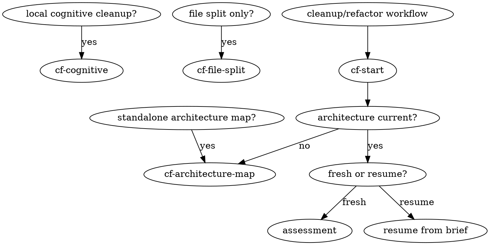
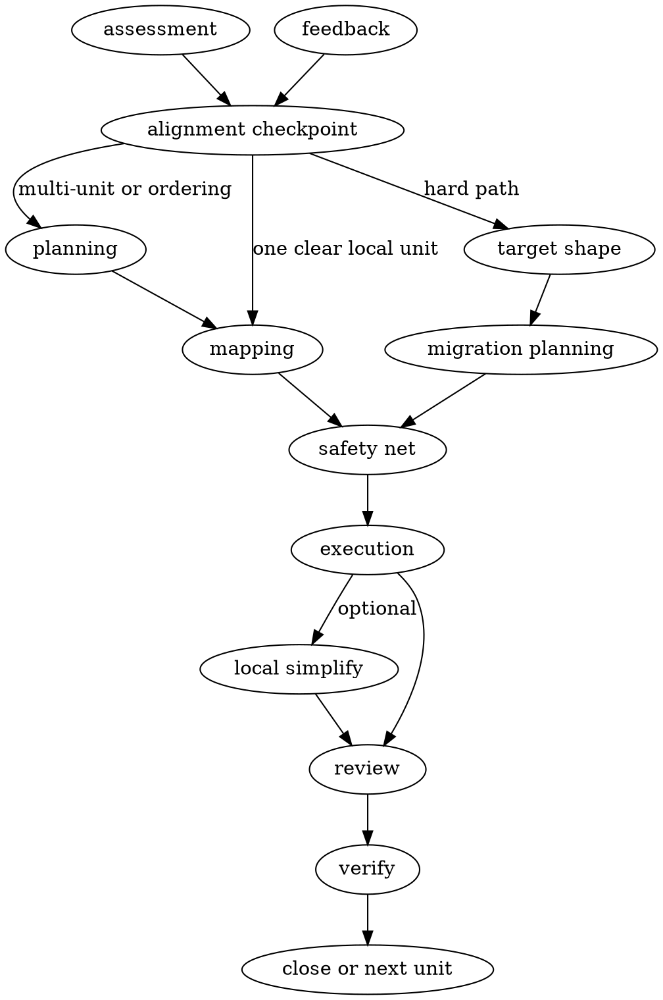

This is the main public workflow entrypoint for the pack and the controller for the Cflow workflow.
It runs the internal phases itself by loading the relevant references in `references/`.
Do not tell the user to invoke phase references directly.
Do not behave like a router that only suggests another step.
When the next phase is clear from repository state and Cflow artifacts, advance into it yourself.

## Goal

Handle fresh assessment, artifact-backed resume, or review/verify re-entry through `cf-start`.
Use `references/routing.md` for path decisions after the initial repository read.

## Entry routing

Use this diagram as the runtime routing contract.

## Workflow lifecycle

Use this diagram as the lifecycle contract after architecture context is current.

## Hard rule

For non-trivial fresh work, always stop at an **alignment checkpoint** after the initial assessment.
Do this even when you already have a recommendation.

At the checkpoint:

- if the user replies with simple confirmation only, continue with the proposed path
- if the user gives a reply that may materially change the path, stay in the alignment phase first

Simple confirmation means short approval with no new steering.
A reply is non-trivial when it may materially change scope, exclusions, invariants, risk appetite, direction, or whether to continue.
Questions that do not affect those decisions can be answered briefly before continuing.

## Language rules

- Use the user's language for conversational output.
- Use the repository's dominant documentation language for `.cflow/architecture.md` and `.cflow/refactor-brief.md`.
- If the repository has no dominant documentation language, use the user's language for those artifacts too.

## Preflight

1. Read `.cflow/architecture.md` if it exists.
2. Read `.cflow/refactor-brief.md` if it exists.
3. Re-check the repository state.
4. Treat the repository as the source of truth.

## Reference map

Read each reference in this invocation when its trigger is met:

| Reference | Trigger |
| --- | --- |
| [references/routing.md](references/routing.md) | ambiguous entry mode, non-trivial fresh path selection, or resume routing that is not obvious from an active current work unit |
| [references/artifacts.md](references/artifacts.md) | creating or refreshing `.cflow/refactor-brief.md`, or deciding required brief field updates |
| [references/assessment.md](references/assessment.md) | fresh assessment, premise checks, or post-assessment alignment |
| [references/planning.md](references/planning.md) | sequencing multiple work units, defining hard-path target shape, or planning migration units |
| [references/mapping.md](references/mapping.md) | mapping concentration pressure, fragmentation pressure, split direction, or consolidation direction |
| [references/execution.md](references/execution.md) | choosing a safety lock, applying a split or consolidation step, or doing local post-structural simplification |
| [references/closure.md](references/closure.md) | review, verification, or feedback intake |

## Fresh assessment

Use [references/routing.md](references/routing.md) for intent inference, fresh assessment details, and path selection.
Use [references/assessment.md](references/assessment.md) for premise checks and alignment behavior.

Do not implement during fresh assessment.
Always end non-trivial fresh assessment at the alignment checkpoint with exactly one focused question.

## Resume

Resume is not a phase. Re-enter the correct phase using the brief and the repository.

Use the brief, repository state, and [references/routing.md](references/routing.md) to resume from the correct phase.
Do not silently switch direction without updating artifacts.
Do not execute more than one cohesive bounded unit per invocation unless the user explicitly asked for a broader pass.

## Output rules

User-facing output is a progress summary, not a brief mirror.
Keep durable state in `.cflow/refactor-brief.md`.
Return only the relevant format below.

### For fresh assessment
Return only:

- **Repository assessment**: the intervention decision and the evidence that matters.
- **Pressure**: concentration, fragmentation, mixed, or none.
- **Proposed path**: the recommended path and why.
- **Artifacts**: created or updated files, one line.
- **Alignment checkpoint**: exactly one focused question.

End with exactly one focused question.

### For execution or resume progress
Return only:

- **Done**: what changed in code or assessment.
- **Checks**: commands run and pass/fail result.
- **Artifacts**: created or updated files, one line.
- **Remaining**: only blockers, risks, or real follow-up work.
- **Next action**: one immediate action or `none`.

### For reassessment without code changes
Return only:

- **Current state**: one sentence.
- **Reassessment result**: the decision and why.
- **Artifacts**: created or updated files, one line.
- **Next action**: one immediate action or `none`.

## Artifact update baseline

`cf-architecture-map` owns `.cflow/architecture.md`.
`cf-start` owns `.cflow/refactor-brief.md`; update it through [references/artifacts.md](references/artifacts.md).
